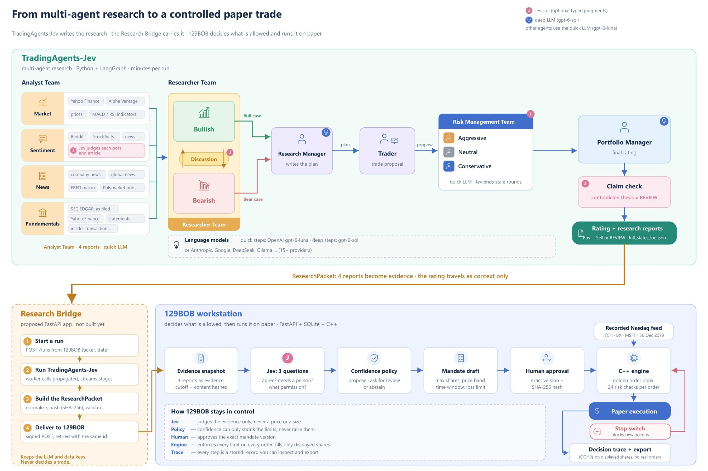

# TradingAgents-Jev

**by NoSlack Labs**

The slow lane of a three-speed trading system: LLM agents decide what to trade,
how much risk to take and when to stand down. The fast lanes, a C++ engine and
an FPGA pipeline that never wait on a model, live in
[129BOB](https://github.com/sushant-mishra-dtu/129BOB).

This is a fork of [TauricResearch/TradingAgents](https://github.com/TauricResearch/TradingAgents)
([arXiv 2412.20138](https://arxiv.org/abs/2412.20138), Apache 2.0). It adds
[TypeSafe Jev](https://docs.typesafe.ai) typed judgments where an LLM's free
text is a poor fit, and keeps numbers, dates and counting in code.

## What this fork adds

| Addition | What it does | Where |
| --- | --- | --- |
| Screened, scored sentiment | Jev judges each news article and social post: off-topic items, repeats and posts carrying instructions aimed at an AI are dropped; the sentiment band, score and confidence are computed in code from per-item stances, and the LLM writes only the narrative | [TypeSafe Jev](#typesafe-jev-optional) |
| Debates that stop early | The bull/bear and risk debates end once a full round adds no new argument, saving one call per skipped turn | [TypeSafe Jev](#typesafe-jev-optional) |
| Claim check on the final decision | The Portfolio Manager's thesis is checked against the analyst reports; a contradicted claim turns the rating into `REVIEW` instead of a trade | [TypeSafe Jev](#typesafe-jev-optional) |
| Learning from the reports | `tradingagents learn` tests whether Jev's judgments of a backtest's reports predict outcomes better than the rating alone, on chronological holdouts | [Learning from the reports](#learning-from-the-reports-jev) |
| Browser UI | Analyze a ticker and watch each desk stream in, inspect every sentiment judgment, read saved reports and run backtests | [Browser UI](#browser-ui) |

The survey of where Jev fits, and how each fit was built and checked, is in
[docs/jev-use-cases.md](docs/jev-use-cases.md).

## From research to a paper trade



The top half is this repo. Four analysts on the quick LLM write the market,
sentiment, news and fundamentals reports. The bull and bear researchers debate
them, the Research Manager (deep LLM) writes the plan, the Trader turns it into
a proposal, the aggressive, neutral and conservative risk analysts argue it, and
the Portfolio Manager (deep LLM) gives the final rating. Jev is called where the
chart shows **J**: it judges each sentiment item, ends debate rounds that add
nothing new, and checks the final thesis against the reports. Each run is saved
as `<results_dir>/<TICKER>/TradingAgentsStrategy_logs/full_states_log_<date>.json`.

The bottom half is [129BOB](https://github.com/sushant-mishra-dtu/129BOB). It
takes the four analyst reports as evidence and the rating as context only, asks
Jev its own three questions, and lets a versioned policy, a person's approval
and the C++ engine's risk checks decide what may trade, on paper only. Today
129BOB imports a saved `full_states_log_<date>.json`; the Research Bridge in
the middle, which would start runs and deliver them, is proposed and not built.

## Quick start

```bash
git clone https://github.com/sushant-mishra-dtu/TradingAgents-Jev.git
cd TradingAgents-Jev
uv venv --python 3.12 && source .venv/bin/activate
uv pip install ".[jev]"
cp .env.example .env      # add an LLM provider key, and TYPESAFE_API_KEY for Jev
tradingagents ui          # http://localhost:8501
```

Without `TYPESAFE_API_KEY` everything runs as upstream TradingAgents does. Set
`TRADINGAGENTS_JEV_ENABLED=false` to turn every Jev call off with the key set.

> For research only. Not financial, investment or trading advice.

---

The rest of this README is the upstream documentation, updated where the fork
changes behaviour. All credit for the underlying framework goes to its authors.

# TradingAgents: Multi-Agents LLM Financial Trading Framework

## News

<!-- news:start -->
- [2026-10] **TradingAgents v0.6.0** released with reports saved as one HTML page, a provider per model tier so the managers and analysts can run on different models, past decisions settled for every ticker while the analysts work, and company news read from Yahoo search while Yahoo's news feed is down.
- [2026-09] **TradingAgents v0.5.2** released with parallel analysts for a faster analysis, a CLI that runs without prompts from flags such as `--ticker` and `--date`, the run's settings recorded in every report, and backtests that see only data published by each analysis date.
- [2026-09] **TradingAgents v0.5.1** released with a package layout organised by what each module holds (import paths moved), optional Jev screening of social posts, GPT-6 Sol and Luna as the default models, and fixes to run isolation and SEC EDGAR statements.

Full release notes are in [CHANGELOG.md](CHANGELOG.md).

<details>
<summary>Earlier news</summary>

- [2026-09] **TradingAgents v0.5.0** released with point-in-time integrity across every dated path, SEC EDGAR fundamentals served as filed, backtesting over a ticker and date grid, portfolio-aware runs, and current model lineups across every provider.
- [2026-08] **TradingAgents v0.4.0** released with look-ahead / point-in-time fixes across FRED macro, social sentiment, and the decision-log memory; clearer decision signals; working CLI checkpoint resume; Trader price grounding; and the GPT-5.6 and GLM-5.3 models.
- [2026-07] **TradingAgents v0.3.1** released with correctness and stability fixes: Alpha Vantage look-ahead filtering, graph-router crash-safety, graph-shape-aware checkpoint resume, working crypto sentiment sources, a configurable LLM retry budget, Bedrock API-key auth, and Claude Sonnet 5 / Fable 5 support.
- [2026-06] **TradingAgents v0.3.0** released with a verified data-access contract, an expanded provider registry (NVIDIA, Kimi, Groq, Mistral, Bedrock, and any OpenAI-compatible endpoint), FRED and Polymarket data vendors, a current-generation model catalog, and a CI gate.
- [2026-05] **TradingAgents v0.2.5** released with the grounded Sentiment Analyst, GPT-5.5 etc. model coverage, Qwen/GLM/MiniMax dual-region support, `TRADINGAGENTS_*` env-var configurability with API-key auto-detection, remote Ollama support, non-US alpha benchmarks, and ticker path-traversal hardening.
- [2026-04] **TradingAgents v0.2.4** released with structured-output agents (Research Manager, Trader, Portfolio Manager), LangGraph checkpoint resume, persistent decision log, DeepSeek/Qwen/GLM/Azure provider support, Docker, and a Windows UTF-8 encoding fix.
- [2026-03] **TradingAgents v0.2.3** released with multi-language support, GPT-5.4 family models, unified model catalog, backtesting date fidelity, and proxy support.
- [2026-03] **TradingAgents v0.2.2** released with GPT-5.4/Gemini 3.1/Claude 4.6 model coverage, five-tier rating scale, OpenAI Responses API, Anthropic effort control, and cross-platform stability.
- [2026-02] **TradingAgents v0.2.0** released with multi-provider LLM support (GPT-5.x, Gemini 3.x, Claude 4.x, Grok 4.x) and improved system architecture.
- [2026-01] **Trading-R1** [Technical Report](https://arxiv.org/abs/2509.11420) released, with [Terminal](https://github.com/TauricResearch/Trading-R1) expected to land soon.

</details>
<!-- news:end -->

<div align="center">

🚀 [TradingAgents](#tradingagents-framework) | ⚡ [Installation & CLI](#installation-and-cli) | 🎬 [Demo](https://www.youtube.com/watch?v=90gr5lwjIho) | 📦 [Package Usage](#tradingagents-package) | 🤝 [Contributing](#contributing) | 📄 [Citation](#citation)

</div>

> 🎉 **TradingAgents** officially released! We have received numerous inquiries about the work, and we would like to express our thanks for the enthusiasm in our community.
>
> So we decided to fully open-source the framework. Looking forward to building impactful projects with you!

## TradingAgents Framework

TradingAgents is a multi-agent trading framework that mirrors the dynamics of real-world trading firms. By deploying specialized LLM-powered agents: from fundamental analysts, sentiment experts, and technical analysts, to trader, risk management team, the platform collaboratively evaluates market conditions and informs trading decisions. Moreover, these agents engage in dynamic discussions to pinpoint the optimal strategy.

<p align="center">
  
</p>

> TradingAgents framework is designed for research purposes. Trading performance may vary based on many factors, including the chosen backbone language models, model temperature, trading periods, the quality of data, and other non-deterministic factors. [It is not intended as financial, investment, or trading advice.](https://tauric.ai/disclaimer/)

Our framework decomposes complex trading tasks into specialized roles.

### Analyst Team
- Fundamentals Analyst: Evaluates company financials and performance metrics, identifying intrinsic values and potential red flags.
- Sentiment Analyst: Aggregates news headlines, StockTwits, and Reddit chatter into a single sentiment read to gauge short-term market mood.
- News Analyst: Monitors global news and macroeconomic indicators, interpreting the impact of events on market conditions.
- Technical Analyst: Utilizes technical indicators (like MACD and RSI) to detect trading patterns and forecast price movements.

The selected analysts work at the same time, each on its own tools, and the research debate starts once all of their reports are in.

<p align="center">
  
</p>

### Researcher Team
- Comprises both bullish and bearish researchers who critically assess the insights provided by the Analyst Team. Through structured debates, they balance potential gains against inherent risks.

<p align="center">
  
</p>

### Trader Agent
- Composes reports from the analysts and researchers to make informed trading decisions, determining the timing and magnitude of trades.

<p align="center">
  
</p>

### Risk Management and Portfolio Manager
- Continuously evaluates portfolio risk by assessing market volatility, liquidity, and other risk factors. The risk management team evaluates and adjusts trading strategies, providing assessment reports to the Portfolio Manager for final decision.
- The Portfolio Manager approves/rejects the transaction proposal. If approved, the order will be sent to the simulated exchange and executed.

<p align="center">
  
</p>

## Installation and CLI

### Installation

Clone TradingAgents-Jev:
```bash
git clone https://github.com/sushant-mishra-dtu/TradingAgents-Jev.git
cd TradingAgents-Jev
```

TradingAgents needs Python 3.11 or later. Create a virtual environment in any of your favorite environment managers:
```bash
conda create -n tradingagents python=3.13
conda activate tradingagents
```

Or with [uv](https://docs.astral.sh/uv/):
```bash
uv venv --python 3.13
source .venv/bin/activate
```

Install the package and its dependencies (`uv pip install .` with uv):
```bash
pip install .
```

### Docker

Alternatively, run with Docker:
```bash
cp .env.example .env  # add your API keys
docker compose run --rm tradingagents
```

After updating the repository, rebuild the image with `docker compose build`.

Results, reports, the memory log and the cache live in the `tradingagents_data` volume. To keep them in a folder on the host instead, create the folder and point `TRADINGAGENTS_DATA_DIR` at it, in `.env` or the shell: `mkdir -p data && TRADINGAGENTS_DATA_DIR=./data docker compose run --rm tradingagents`.

For local models with Ollama:
```bash
docker compose --profile ollama run --rm tradingagents-ollama
```

### Required APIs

TradingAgents supports multiple LLM providers. Set the API key for your chosen provider:

```bash
export OPENAI_API_KEY=...          # OpenAI (GPT)
export GOOGLE_API_KEY=...          # Google (Gemini)
export ANTHROPIC_API_KEY=...       # Anthropic (Claude)
export XAI_API_KEY=...             # xAI (Grok)
export DEEPSEEK_API_KEY=...        # DeepSeek
export DASHSCOPE_API_KEY=...       # Qwen (international, dashscope-intl.aliyuncs.com)
export DASHSCOPE_CN_API_KEY=...    # Qwen (China, dashscope.aliyuncs.com)
export ZHIPU_API_KEY=...           # GLM via Z.AI (international)
export ZHIPU_CN_API_KEY=...        # GLM via BigModel (China, open.bigmodel.cn)
export MINIMAX_API_KEY=...         # MiniMax (global, api.minimax.io)
export MINIMAX_CN_API_KEY=...      # MiniMax (China, api.minimaxi.com)
export OPENROUTER_API_KEY=...      # OpenRouter
export MISTRAL_API_KEY=...         # Mistral
export MOONSHOT_API_KEY=...        # Kimi (Moonshot)
export GROQ_API_KEY=...            # Groq
export NVIDIA_API_KEY=...          # NVIDIA NIM
export FRED_API_KEY=...            # FRED macro data (free, optional)
export ALPHA_VANTAGE_API_KEY=...   # Alpha Vantage
export TYPESAFE_API_KEY=...        # Jev social-post screening (optional)
```

For Azure OpenAI, copy `.env.enterprise.example` to `.env.enterprise` and fill in your credentials.

For AWS Bedrock, install the extra with `pip install ".[bedrock]"`, set `llm_provider: "bedrock"`, configure AWS credentials (environment variables, `~/.aws/credentials`, or an IAM role) and `AWS_DEFAULT_REGION`, and use a Bedrock model ID, e.g. `us.anthropic.claude-opus-5-5`.

For NVIDIA NIM, set `llm_provider: "nvidia"`. The picker lists Nemotron 3 Super 120B (`nvidia/nemotron-3-super-120b-a12b`, 1M context, tool calling) for both the quick and deep model; pick "Custom model ID" for any other NIM model. The free build.nvidia.com endpoints run on trial credits and are meant for testing and evaluation.

Shared and trial endpoints such as NVIDIA NIM sometimes return bursts of server errors mid-run. For OpenAI and every OpenAI-compatible provider (all of the above except Anthropic, Google, Azure and Bedrock), a call that hits a 5xx, a dropped connection or a rate limit is retried after 10, 20, 40, 60 and 60 seconds, on top of the SDK's own quick retries, before the run fails. Each retry is logged.

For local models, configure Ollama with `llm_provider: "ollama"`. The default endpoint is `http://localhost:11434/v1`; set `OLLAMA_BASE_URL` to point at a remote `ollama-serve`. Pull models with `ollama pull <name>`, and pick "Custom model ID" in the CLI for any model not listed by default.

For any other OpenAI-compatible server (vLLM, LM Studio, llama.cpp, or a custom relay), use `llm_provider: "openai_compatible"` and set the endpoint via `backend_url` (or `TRADINGAGENTS_LLM_BACKEND_URL`), e.g. `http://localhost:8000/v1` for vLLM or `http://localhost:1234/v1` for LM Studio. The model is whatever your server serves. No key is needed for local servers; set `OPENAI_COMPATIBLE_API_KEY` when the endpoint requires one.

With `TYPESAFE_API_KEY` set, the Sentiment Analyst screens StockTwits and Reddit posts with TypeSafe's Jev before reading them. Posts that are not about the company are dropped, and each source opens with a count of the remaining posts by stance: bullish, bearish, neutral, or unclear. Without the key, posts pass through unscreened. `jev-latest` moves with new releases; set `TYPESAFE_DEFAULT_MODEL` to a versioned ID such as `jev-1.13.0` to hold it fixed across runs. To reach Jev through OpenRouter, put an OpenRouter key in `TYPESAFE_API_KEY` and set `TYPESAFE_BASE_URL=https://openrouter.ai/api`.

Alternatively, copy `.env.example` to `.env` and fill in your keys:
```bash
cp .env.example .env
```

### CLI Usage

Launch the interactive CLI:
```bash
tradingagents          # installed command
python -m cli.main     # alternative: run directly from source
```
You will see a screen where you can select your desired tickers, analysis date, LLM provider, research depth, and more. Your previous run's answers come back as the defaults, so pressing Enter accepts them. The `TRADINGAGENTS_*` variables in `.env` still skip their step entirely.

To run without questions, for a scheduled job or a script, answer the per-run steps with flags and the rest with `TRADINGAGENTS_*` variables:
```bash
export TRADINGAGENTS_LLM_PROVIDER=openai TRADINGAGENTS_QUICK_THINK_LLM=gpt-6-luna TRADINGAGENTS_DEEP_THINK_LLM=gpt-6-sol
export TRADINGAGENTS_OUTPUT_LANGUAGE=English TRADINGAGENTS_MAX_DEBATE_ROUNDS=1 TRADINGAGENTS_MAX_RISK_ROUNDS=1
tradingagents --ticker NVDA --date 2026-09-23 --analysts market,news,fundamentals --save --no-show
```
Each flag skips only its own question. Run without a terminal, a missing answer stops the run before it starts and names the flag or variable to set.

A saved report also includes `complete_report.html`, the report as one page with its sections listed beside the text, for reading in a browser, on a phone or in print. Answering the save question at the prompt also asks about the page and can open it in your browser; `--no-html` skips it, and so does `ta.save_reports(state, "NVDA", html=False)` from Python.

### Browser UI

The same workflow in a browser, plus a history of past reports and a backtest dashboard. It needs nothing beyond the base install:
```bash
tradingagents ui       # serves http://localhost:8501 and opens the Analyze page
tradingagents ui --port 8600 --no-browser
```
- **Analyze** — pick a ticker, date, analysts and an optional portfolio file, then watch each desk of the pipeline, the metrics, tool calls and report sections as the run streams in. The portfolio manager's rating shows at the end, and the full report is saved under `results_dir/reports`. The ticker box searches by symbol or company name, so "reliance industries" offers `RELIANCE.NS` and "tencent" offers `0700.HK`; a provider retry shows in the run's activity log instead of the run looking stalled.
- **Company** — one stock's fundamentals laid out like a stock screener: key ratios, a price chart with 50- and 200-day averages and volume, quarterly results, profit and loss with a TTM column, balance sheet, cash flows, working-capital ratios, compounded growth, and pros and cons from fixed rules (no LLM). Indian companies show figures in ₹ crores with Indian digit grouping, and banks get a lender's layout. The figures come live from Yahoo Finance, usually about four years and five quarters, and only what Yahoo has is shown. Because they are today's figures rather than point-in-time ones, no analysis or backtest reads them. **Analyze with agents** opens the Analyze page with the ticker filled in. For a stock in the India database the page adds a **Peer comparison** (see [Peers and industries](#peers-and-industries)), **+ Watchlist** and **Create alert**; **Export to Excel** saves the page as a workbook.
- **Screens** — filter every NSE stock on its fundamentals, shareholding and price with conditions such as `Market Capitalization > 500 AND ROCE > 20`; see [Stock screener](#stock-screener-india) below. Selected rows go to a watchlist, a saved screen can alert you when stocks enter or leave it, and the results export as CSV or Excel.
- **Industry** — every stock NSE files under one industry, with the industry's medians and a link that opens it as a screen.
- **Watchlists** — named lists of stocks with notes and, optionally, holdings and their P&L; see [Watchlists](#watchlists).
- **Alerts** — price, metric, screen, filing and shareholding alerts, with an inbox and a bell in the sidebar showing the unread count; see [Alerts](#alerts).
- **Sentiment** — with Jev on, every news article and social post the Sentiment Analyst judged: its stance, event type, relevance and whether it was kept, or dropped as a duplicate, off-topic or an injected instruction. Open it from a live run or from a saved report.
- **Reports** — read any saved report by section, and browse the decision log with each call's alpha, decision and reflection.
- **Backtest** — start a grid sweep (the tickers box completes each comma-separated entry the same way), follow the cell being run, stop it between cells, then compare mean alpha and hit rate by rating.

Ticker search asks Yahoo Finance and falls back to a built-in list of well-known symbols when Yahoo is unreachable or rate-limited. Model settings live in the sidebar of the Analyze page and share the CLI's remembered answers and `.env` overrides. Runs continue in the background, so reloading the page does not stop them. The server binds to `127.0.0.1`; pass `--host 0.0.0.0` only on a network you trust, since the page starts paid LLM runs. It answers only requests addressed to `localhost`, `127.0.0.1` or `[::1]` (and the address given to `--host`), so another website cannot reach it by pointing its own domain at your machine; to open it from another machine by name, add `--allow-host <name>` (repeatable). `http://localhost:8501/` itself is an overview page, and the light/dark theme follows your system unless you pick one.

### TypeSafe Jev (optional)

With `pip install ".[jev]"` and `TYPESAFE_API_KEY` set, the Sentiment Analyst first judges each news article and social post with [TypeSafe Jev](https://docs.typesafe.ai). It drops items about other companies, repeats, and posts carrying instructions aimed at an AI system, then computes the sentiment band, score and confidence from per-item stances; the LLM writes only the narrative. This takes the place of the post screening above, so posts are not sent to Jev twice; with the key but without the extra, only the post screening runs. The bull/bear and risk debates end early once a full round adds no new argument (never before round 2 or past the configured rounds, so this applies from three rounds up), and the Research Manager gets Jev's read of whose case is better supported as a hint.

At the end of the run, the Portfolio Manager's Investment Thesis is checked against the analyst reports, which the Portfolio Manager never reads itself. Jev judges which claims are checkable facts and whether each report section supports or contradicts them; figures are matched in code, and a claim that could only be settled by comparing numbers is marked unverified rather than judged. The result is appended to the decision, and a contradicted claim, or a thesis whose claims are mostly not found in the reports, turns the rating into `REVIEW` instead of a trade. Set `TRADINGAGENTS_JEV_CLAIM_CHECK=false` to turn off the claim check alone, or `TRADINGAGENTS_JEV_ENABLED=false` to turn off every Jev call, the post screening included.

After a backtest, `tradingagents learn <run id>` tests whether Jev's judgments of the reports predict outcomes better than the rating alone; see [Learning from the reports](#learning-from-the-reports-jev). Details: [docs/jev-use-cases.md](docs/jev-use-cases.md).

### Markets and tickers

TradingAgents works with any market Yahoo Finance covers, using the exchange-suffixed ticker. Company identity and the alpha benchmark resolve automatically per market.

- US: `AAPL`, `SPY`
- Hong Kong: `0700.HK` · Tokyo: `7203.T` · London: `AZN.L`
- India: `RELIANCE.NS`, `.BO` · Canada: `.TO` · Australia: `.AX`
- China A-shares: Shanghai `.SS`, Shenzhen `.SZ` (e.g. `600519.SS` for Kweichow Moutai)
- Crypto: `BTC-USD`, `ETH-USD`

<p align="center">
  
</p>

An interface will appear showing results as they load, letting you track the agent's progress as it runs.

<p align="center">
  
</p>

<p align="center">
  
</p>

## TradingAgents Package

### Implementation Details

We built TradingAgents with LangGraph to ensure flexibility and modularity. The framework supports multiple LLM providers: OpenAI, Google, Anthropic, xAI, DeepSeek, Qwen (Alibaba DashScope, international and China endpoints), GLM (Zhipu), MiniMax (global + China), OpenRouter, Ollama for local models, and Azure OpenAI for enterprise.

### Python Usage

To use TradingAgents inside your code, you can import the `tradingagents` module and initialize a `TradingAgentsGraph()` object. The `.propagate()` function will return a decision. You can run `main.py`, here's also a quick example:

```python
from tradingagents.graph.trading_graph import TradingAgentsGraph
from tradingagents.default_config import DEFAULT_CONFIG

ta = TradingAgentsGraph(debug=True, config=DEFAULT_CONFIG.copy())

# forward propagate
state, decision = ta.propagate("NVDA", "2026-09-01")
print(decision)

# the same report tree the CLI saves, under results_dir/reports
ta.save_reports(state, "NVDA")
```

You can also adjust the default configuration to set your own choice of LLMs, debate rounds, etc.

```python
from tradingagents.graph.trading_graph import TradingAgentsGraph
from tradingagents.default_config import DEFAULT_CONFIG

config = DEFAULT_CONFIG.copy()
config["llm_provider"] = "openai"        # e.g. openai, google, anthropic, deepseek, groq, ollama; openai_compatible covers any OpenAI-compatible endpoint (vLLM, LM Studio, llama.cpp, ...)
config["deep_think_llm"] = "gpt-6-sol"    # Model for complex reasoning
config["quick_think_llm"] = "gpt-6-luna"   # Model for quick tasks
config["max_debate_rounds"] = 2

ta = TradingAgentsGraph(debug=True, config=config)
_, decision = ta.propagate("NVDA", "2026-09-01")
print(decision)
```

The quick model serves the analysts, researchers, debaters and trader; the deep model serves the research and portfolio managers. Each can run on its own provider, for example the managers on Claude while the rest run on OpenAI:

```python
config["deep_think_provider"] = "anthropic"
config["deep_think_llm"] = "claude-opus-5-5"
```

A tier on its own provider uses that provider's key and default endpoint; set `quick_think_backend_url` or `deep_think_backend_url` for a local or relay endpoint. The `TRADINGAGENTS_DEEP_THINK_PROVIDER` and `TRADINGAGENTS_QUICK_THINK_PROVIDER` variables set them for the CLI, together with the tier's model variable.

See `tradingagents/default_config.py` for all configuration options.

### India data (NSE archives and filings)

`tradingagents india ...` keeps a local SQLite database of Indian listed companies (`TRADINGAGENTS_INDIA_DB`, default `~/.tradingagents/india/india.db`; raw downloads cached under `<cache>/india/raw`). The Company page uses it for `.NS`/`.BO` symbols and falls back to Yahoo Finance section by section.

```bash
tradingagents india sync-securities                 # NSE equity list + index industries
tradingagents india sync-prices --from 2016-01-01   # bhavcopies + delivery, one-time backfill
tradingagents india sync-actions --from 2016-01-01  # splits, bonuses, rights, dividends, shares issued
tradingagents india sync-documents --universe nifty50 --from 2026-01-01   # announcement links
tradingagents india import ~/Downloads/xbrl         # results / shareholding XBRL you saved
tradingagents india status
tradingagents india sync-all                        # the nightly run (schedule it yourself)
tradingagents india reparse-actions                 # re-read stored corporate actions after a parser fix
```

Every sync resumes where the last one stopped; `--force` redoes the days or files already done. One sync runs at a time (an import too), and a command exits non-zero only when the run itself cannot go on: the host refusing us or redirecting off the archive, the network down, another sync running, or a bad argument.

| Command | Options |
| --- | --- |
| `sync-securities` | `--force` |
| `sync-prices` | `--from YYYY-MM-DD` (required), `--to` (default today), `--force` |
| `sync-actions` | `--from` (default a year ago), `--to` (default today), `--force` |
| `sync-documents` | announcement and board-meeting links (results, annual reports, concalls, credit ratings) from NSE's daily PR files: `--symbols RELIANCE,TCS` or `--universe nifty50`, `nifty500` (the default) or `all`; `--from` (default a year ago), `--to` (default today), `--force` |
| `import PATH...` | files or folders of results and shareholding XBRL, in any folder. `--filed-at YYYY-MM-DD` or `YYYY-MM-DDTHH:MM` says when they became public, for files whose names do not carry NSE's submission time; `--force` re-imports. A path that does not exist stops the command; a folder with no `.xml` files is noted |
| `sync-results`, `sync-shareholding` | import only that kind from the inbox (`--dir`, default `<cache>/india/inbox`): `--symbols` or `--universe`, `--from YEAR` (the earliest period), `--force` |
| `sync-all` | securities, the new days of prices, actions and announcements (announcements for `--universe`, default `nifty500`), then the inbox (`--dir`); then the live snapshot (`--snapshot/--no-snapshot`) and your alerts (`--alerts/--no-alerts`), both on by default; `--force` |
| `build-snapshot` | see [Stock screener](#stock-screener-india): `--as-of`, `--cutoff`, `--universe` |
| `evaluate-alerts` | see [Alerts](#alerts): `--kinds` |
| `reparse-actions`, `status` | no options |

The downloads can be tuned with environment variables (or `.env`):

| Variable | Effect |
| --- | --- |
| `TRADINGAGENTS_INDIA_DB` | the database file (default `~/.tradingagents/india/india.db`) |
| `TRADINGAGENTS_INDIA_REQUEST_INTERVAL` | seconds between requests to the archive; at least 1, and a smaller value is raised to 1 |
| `TRADINGAGENTS_INDIA_USER_AGENT` | your contact (an email or URL), appended to the `TradingAgents/<version>` User-Agent every request carries |

Sources and their terms (checked 2026-10-05):
- **archives.nseindia.com** (equity list, index lists, bhavcopies with ISIN from 2016, MTO deliveries and daily PR files from 2010) is fetched at most once a second with an honest User-Agent. NSE's Terms of Use prohibit "systematic or automated data collection"; running these syncs is your decision, for personal use.
- **NSE's JSON APIs and nsearchives.nseindia.com** (where results and shareholding XBRL live) answer only browsers, and **BSE** refuses non-browser clients. They are not fetched. Save filings from NSE's (or BSE's) filing pages and import them; drop them in `<cache>/india/inbox` for `sync-results`, `sync-shareholding` and `sync-all`.

Every financial and shareholding value keeps its `filed_at`; restatements are kept as separate rows, and `store.get_financials(isin, as_of=...)` sees only what was public by then.

### Stock screener (India)

The **Screens** page and `tradingagents screen ...` filter every stock in the India database on about 100 metrics. Screens read a precomputed snapshot, so build one once the database has prices:

```bash
tradingagents india build-snapshot                      # the live snapshot (also rebuilt by india sync-all)
tradingagents india build-snapshot --as-of 2025-10-06   # a historical one, kept beside it
tradingagents india build-snapshot --as-of 2025-10-06 --cutoff 15:30   # only filings made by the close
tradingagents screen run "Market Capitalization > 500 AND Return on capital employed > 20"
tradingagents screen run "Return over 1 year > 20" --as-of 2025-10-06 --limit 50 --sort return_1y
tradingagents screen run "ROCE > 20" --columns pe,roe,market_cap --sort roe   # extra columns, by metric key
tradingagents screen list                               # your saved screens and the presets
tradingagents screen metrics growth                     # the metrics whose names match "growth"
```

**Query syntax.** A condition compares metrics, numbers and arithmetic: `ROCE > 20`, `Current price > 200 DMA`, `Net profit / Sales * 100 > 10`. Comparisons are `> < >= <= = !=`; join conditions with `AND`, `OR`, `NOT` and brackets, or write one per line: a new line is an AND that binds loosest, so each line stands on its own (`ROCE > 20` then `ROE > 15 OR P/E < 10` on the next line means ROCE > 20 AND (ROE > 15 OR P/E < 10)). Text metrics (Name, NSE symbol, Industry, also called Sector) take quoted values, `Industry = 'Capital Goods'` or `Industry IN ('Power', 'Utilities')`, ignoring case. Metric names hold spaces and match their aliases case-insensitively (`Return on capital employed`, `ROCE`, `ROCE %`). Numbers may be written `1,000`, `1,00,000`, `1e3` or `20%`. A query is at most 4,000 characters and 40 levels deep, and runs for at most 2 seconds. Errors say where, by line and column, and suggest the metric you meant: `Unknown metric 'Retrun on equity' at col 1 — did you mean 'Return on equity'?`.

**Units.** Amounts are in Rs. crores (`Market Capitalization > 500` is Rs 500 Cr), per-share figures in rupees, percentages in % (`ROE > 15`), changes in holdings in percentage points, and multiples (P/E, debt to equity) as plain numbers. Each metric's unit is listed on the page and by `screen metrics`.

**Missing data never passes.** A comparison with a value the database lacks is unknown, and stays unknown under `NOT`, so the stock is left out; only a branch of an `OR` that is true for it can let it in. The page and the CLI say how many stocks were left out for missing data. Banks and NBFCs have no ROCE, margins, debt to equity or working-capital figures, so they drop out wherever those are used. Division by zero gives a blank, not an error.

**What the figures are.** "TTM" is the latest four quarters summed when the newest quarter is after the newest fiscal year, else that year; "last year" is the newest fiscal year filed; balance-sheet figures are the newest year-end balance sheet's. Prices are adjusted for splits, bonuses and rights, not dividends, and a stock with no close in the 15 days before the snapshot has no price. Market capitalisation is the last close times the shares outstanding: NSE's own issued-share count from its daily PR file when the database has it, else the latest shareholding pattern's total, else equity capital over face value, each multiplied by any split or bonus since its date. Dividend yield is the past year's dividends per share over the price, 0 when none was paid, blank if the corporate-actions sync does not cover the year. Every formula is the Company page's own (`dataflows/formulas.py`), and the Company page lists every metric in its **All metrics** section, so the two always agree.

**Snapshots.** `metrics_snapshot` in the India database holds a row per stock and a column per metric, keyed by `as_of_date` (`live`, or a date). A historical snapshot reads the database point in time: filings filed by its date, prices up to it, and actions known by then; its universe is the stocks that traded in the 15 days before it, so stocks delisted since stay in. The default universe is listed EQ-series stocks (`screener_universe`: `eq`, `listed`, `all`, or `--universe RELIANCE,TCS`). Pick a historical snapshot on the page, or pass `--as-of`. A date covers its whole day, so results filed that evening count; `--cutoff HH:MM` (India time, with `--as-of`) counts only filings made by then, such as `15:30` for the market close, while prices stay that day's close. `build-snapshot --universe` and `TRADINGAGENTS_SCREENER_UNIVERSE` set the universe. `screen run` takes `--as-of`, `--limit` (rows shown), `--sort KEY` (descending; `+KEY` for ascending; keys as `screen metrics` lists them) and `--columns KEY,KEY` (metrics shown beside those the query uses). The fundamentals screens need results and shareholding filings imported (`tradingagents india import`); with prices only, the price, return, moving-average, market-cap and dividend metrics work and the rest are blank.

**Custom ratios.** Define `Name = expression` over catalog metrics, such as `Earnings to price = Net profit / Market Capitalization`, then use the name in any query. A ratio's name may not be a catalog name or alias, ratios may use other ratios but never in a circle or more than 8 deep, and each is compiled into the query rather than stored. Saved screens and ratios live in `~/.tradingagents/screener/screens.db` (`TRADINGAGENTS_SCREENER_DB`), your own database beside the India one, with your watchlists, alerts and the alert inbox. Rebuilding or re-syncing the India database never touches it; the file's schema is versioned and upgrades itself in place.

**Presets.** Nine read-only starting points, written for this project: debt-free compounders, high ROCE at a reasonable P/E, consistent five-year growers, Piotroski 8 or 9, promoters raising their stake, low price to book with positive free cash flow, near the 52-week high and still growing, dividend yield with low payout risk, and large caps in an uptrend. Duplicate one to edit it. They are not investment advice.

**Analyze with agents.** Tick up to 10 result rows and confirm to queue a full analysis of each. They run one after another, never at once, and each costs LLM calls on the provider in the Analyze page's settings. The queue shows each run's progress, links to it, and can take a run off or stop it.

### Peers and industries

A Company page for a stock in the India database compares it with its **peers**: the ten companies of its NSE industry nearest it in market capitalisation (nearest by ratio, so 500 and 2,000 Cr are equally near 1,000 Cr), the company itself highlighted. The default columns are price, P/E, market cap, dividend yield, the latest quarter's net profit and sales with their year-on-year growth, and ROCE; for a bank or NBFC (filings in the lender formats, or, with none imported, NSE's Financial Services industry) metrics that do not apply to lenders give way to ROE, price to book and return on assets. A column picker offers every catalog metric and custom ratio, columns sort, and a median row sums up the ten.

`/industry?name=Capital Goods` lists every stock of an industry with the industry's medians, and opens it on the Screens page as the screen `Industry = 'Capital Goods'`; `/industry` lists the industries. Both read the live snapshot through the screener's own engine, so a figure reads the same in a screen, among peers and in an industry. Industry comes from NSE's index lists, so only index members (about 750 stocks) have peers; without a snapshot or an industry the section says which command to run (`india build-snapshot`, `india sync-securities`).

One table serves screens, peers, industries and watchlists: sortable columns, the column picker, the median row, pages and sideways scrolling inside its own box.

### Watchlists

The **Watchlists** page keeps any number of named lists of Indian stocks. Add stocks by name or symbol, from a Company page (**+ Watchlist**) or from selected screen results; give each a note; rename, reorder and delete lists; and import or export the symbols as CSV. Import reads a column of symbols, or a header row with `symbol` (or `ticker`) and any of `note`, `quantity`, `avg_price`, so an export reads back in; lines it cannot read are listed with the reason. Export writes `symbol,name,note`, plus `quantity,avg_price` in holdings mode. Each list keeps its own columns and sort. Prices are the latest NSE close in the live snapshot, never a live tick, and the page says which day's.

**Holdings mode** lets each row carry a quantity and an average price (long holdings). The table adds invested value, current value, P&L and P&L % and a total row. **Use as portfolio for agent runs** builds the same `PortfolioContext` a portfolio JSON file gives (`tradingagents.portfolio`) and hands it to the Analyze page's portfolio option, so the trader, risk desk and portfolio manager reason from your holdings; the run's activity log shows the block they read. **Analyze with agents** on a watchlist queues up to 10 runs one at a time, like the Screens page, and can send the holdings with each.

### Alerts

The **Alerts** page sets up five kinds of alert and keeps an inbox of what fired; the bell in the sidebar counts the unread.

| Kind | Fires when |
| --- | --- |
| Price | a stock's close crosses above or below a level, or moves more than X% in a day (up, down or either) |
| Metric condition | a condition in the screen query language, for one stock, turns true: `Price to Earning < 20 AND Promoter holding > 50` |
| Screen membership | stocks enter or leave a saved screen (or a preset) from one live snapshot to the next |
| New filings | a stock, or a watchlist's stocks, gets new results, a shareholding pattern, a corporate action, a credit rating or another announcement |
| Shareholding change | promoter holding moves more than X points from one quarterly pattern to the next, or the pledged share rises by more than X |

Alerts are **edge-triggered**: one fires when its condition goes from false to true, not on every evaluation while it stays true, and a price alert fires at most once a trading day. The first evaluation after you create, edit or switch one back on only records where things stand, and a condition missing data never fires. Each alert can have a cooldown (it stays quiet that long after firing) and a last day. Every firing goes to the inbox with what tripped it (the price and level, the condition's values, who entered and left, the filings) and the date of the data.

**When they are evaluated.** After every `tradingagents india sync-all` (after the snapshot rebuild; `--no-alerts` skips it), by `tradingagents india evaluate-alerts [--kinds price,metric,...]`, and by **Evaluate now** on the page. Evaluation is idempotent: each alert remembers the data it last saw, and evaluating the same data again never fires twice. The optional intraday poller checks price alerts on Yahoo Finance's **delayed** quotes (about 15 minutes behind NSE) while NSE is open, 09:15 to 15:30 India time on weekdays; it is off unless `TRADINGAGENTS_ALERT_POLL_MINUTES` is set (5 or more) when `tradingagents ui` starts. Nothing else reads those quotes.

**Delivery.** The inbox always gets every alert. These channels send it on too, and are off unless their environment variables are set (nothing else configures them, and the page shows only whether each is configured, never a value). Each has a **Send test** button; a failed delivery is noted on its inbox item and never stops the evaluation.

| Channel | Variables |
| --- | --- |
| Telegram | `TRADINGAGENTS_ALERT_TELEGRAM_TOKEN`, `TRADINGAGENTS_ALERT_TELEGRAM_CHAT_ID` |
| Webhook | `TRADINGAGENTS_ALERT_WEBHOOK_URL` (a JSON POST with `text` and `content`, so Slack and Discord incoming webhooks accept it) |
| Email | `TRADINGAGENTS_ALERT_SMTP_HOST`, `TRADINGAGENTS_ALERT_SMTP_TO`, and as needed `_SMTP_PORT` (587 with STARTTLS, or 465), `_SMTP_USER`, `_SMTP_PASSWORD`, `_SMTP_FROM` |

### Export

**Export to Excel** on a Company page saves one workbook, `RELIANCE_financials_2026-10-05.xlsx`, with sheets Summary (key ratios and the screener's metrics), Quarters, Profit & Loss, Balance Sheet, Cash Flow, Ratios, Shareholding and Peers, plus Notes: the sources, the statement basis, the periods each sheet covers and when the file was made. Figures are the page's own, stored as numbers so formulas work on them, with money in Rs. crores as each sheet's corner cell says; headers are bold and frozen.

Screen results, watchlists, peers and industries export as CSV or Excel with exactly the columns and sort on screen, over the whole result rather than the page shown (up to 5,000 rows). CSV is UTF-8 with a byte-order mark, so Excel shows ₹ and other scripts correctly. A text cell beginning with `= + - @` is prefixed with an apostrophe in CSV, and marked as text (`quotePrefix`) in Excel, so a spreadsheet never runs it as a formula. The workbooks are written by a small standard-library XLSX writer (`tradingagents/screener/xlsx.py`), so no extra package is needed; they open in Excel and LibreOffice.

### Fundamentals as filed

US company statements come from SEC EDGAR, which records the date every figure was filed. A run dated in the past reads the statements exactly as they stood that day: a fiscal year that has ended but has not been filed yet is not served, and a figure restated later still reads as first reported. Apple's 2008 total assets were filed as $39.6B and restated to $36.2B in 2010, so a run dated in between reads $39.6B. EDGAR needs no account or API key.

Other companies' statements come from Yahoo Finance, which dates a statement by the period it covers rather than by when it was published. A run dated today reads them; a run dated in the past is told they are withheld, since Yahoo cannot say which figures were public by then.

Insider trades are dated by when they happened, not when they were filed, so a run dated in the past is told they are withheld as well.

SEC asks callers to identify themselves and refuses requests that carry no contact address, so a default one is sent. Set your own so SEC can reach you rather than the project:

```bash
SEC_EDGAR_USER_AGENT="Your Name your@email.com"
```

It covers companies that file with the SEC, including foreign companies listed in the US. Anything else, such as Hong Kong or A-share listings, falls through to the next vendor in the chain. EDGAR's machine-readable filings begin in 2009, and a fourth quarter is reported as unavailable rather than derived, because filers publish it only inside the annual figure.

### Current holdings

By default the agents do not know what you hold, so their guidance is written for a reader who applies it to their own position. Pass a portfolio to have the trader, the risk analysts and the portfolio manager work against your actual book.

```python
from tradingagents.portfolio import PortfolioContext

portfolio = PortfolioContext.model_validate({
    "cash": 25000.0,
    "currency": "USD",
    "positions": [{"ticker": "NVDA", "quantity": 120, "average_price": 150.0}],
})
_, decision = ta.propagate("NVDA", "2026-09-01", portfolio=portfolio)
```

The CLI takes the same content as a JSON file: `tradingagents --portfolio my_book.json`.

An empty `positions` list means a flat book, which is different from passing nothing. A run without a portfolio is never treated as flat.

## Persistence and Recovery

TradingAgents persists two kinds of state across runs.

### Memory log

The memory log is always on. Each completed run appends its decision to `~/.tradingagents/memory/trading_memory.md`. While the analysts of a later run work, TradingAgents settles every logged decision whose holding period has passed: it fetches the realised return (raw, and alpha against the instrument's regional benchmark) and generates a one-paragraph reflection. The Portfolio Manager then reads the most recent decisions for the same ticker plus recent lessons from other tickers, so each analysis carries forward what worked and what didn't. If settling fails, the run goes on and its report says so.

Override the path with `TRADINGAGENTS_MEMORY_LOG_PATH`.

To settle decisions without running an analysis, for a scheduled job, call `ta.settle_all_pending()`; it returns the decisions it settled and any it could not.

### Checkpoint resume

Checkpoint resume is on by default; turn it off with `--no-checkpoint`, `TRADINGAGENTS_CHECKPOINT_ENABLED=false`, or the toggle in the web UI. When enabled, LangGraph saves state after each node so a crashed or interrupted run resumes from the last successful step instead of starting over. The run view says whether it resumed a saved run or started fresh. Checkpoints are cleared automatically on successful completion.

Per-ticker SQLite databases live at `~/.tradingagents/cache/checkpoints/<TICKER>.db` (override the base with `TRADINGAGENTS_CACHE_DIR`). Use `--clear-checkpoints` to reset all of them before a run.

```bash
tradingagents --no-checkpoint        # disable for this run
tradingagents --clear-checkpoints    # reset before running
```

```python
config = DEFAULT_CONFIG.copy()
config["checkpoint_enabled"] = False  # opt out
ta = TradingAgentsGraph(config=config)
_, decision = ta.propagate("NVDA", "2026-09-01")
```

## Evaluating decisions over time

One run gives one decision, which cannot tell you whether the system decides well. `run_backtest` runs the same pipeline over a grid of tickers and dates, writes to a memory log of its own, and scores the decisions whose holding window has since traded.

```python
from tradingagents.backtest import iter_grid, run_backtest, summarize

dates = iter_grid("2026-06-01", "2026-08-01", every_n_days=7)
result = run_backtest(["NVDA", "AAPL"], dates, config, selected_analysts=["market", "news"])
print(summarize(result).render())
```

From the CLI:

```bash
tradingagents backtest NVDA,AAPL --start 2026-06-01 --end 2026-08-01 --every 7
```

Each cell is scored on realized alpha against the instrument's regional benchmark, grouped by rating. Your own memory log is never written to, and re-running the same grid with `run_id=result.run_id` skips the cells that already ran, so an interrupted sweep continues where it stopped.

### Learning from the reports (Jev)

A backtest also keeps every cell's reports, so they can be tested against the outcomes. With the `jev` extra and `TYPESAFE_API_KEY` set:

```bash
tradingagents backtest NVDA,AAPL,MSFT,AMD --start 2026-03-02 --end 2026-08-31 --every 7 --run-id sweep1
tradingagents learn sweep1
```

`learn` asks Jev 14 fixed questions about each settled decision's reports, debates and final decision, such as the price trend, how stretched the valuation is, and which side won the bull/bear debate. It turns the answers into numeric columns and fits a small logistic model of whether the decision beat its benchmark. It holds out the latest dates, and then reports three things:

- whether the model predicts better than the rating alone on the held-out dates;
- which questions help;
- which decisions it predicted worst.

Every split is chronological, and a decision trains a model only if its outcome was already known. The answers are cached, so running `learn` again, or adding a question, asks Jev only what it has not answered. A feature table, `report_features.csv`, is written to the run folder.

This needs at least 40 settled decisions over 6 analysis dates, and many more before a result means much. Nothing in an analysis run uses the model yet. Details, and a live check of the questions: [Fit 5 as built](docs/jev-use-cases.md#fit-5-as-built).

## Reproducibility

TradingAgents is LLM-driven, so two runs of the same ticker and date can differ. This is expected for a research tool built on language models, not a defect. The variation comes from a few distinct sources, and it helps to separate them.

Language model sampling is non-deterministic. Even at a fixed temperature, providers do not guarantee byte-identical output across calls, and reasoning models (the default GPT-6 family, and any thinking-mode model) vary the most because their internal reasoning is itself sampled.

Live data moves. News, StockTwits, and Reddit return different content as time passes, so a run today sees different inputs than a run last week even for the same historical trade date. Pin the analysis date to hold the price and indicator window fixed, but the social and news sources still reflect "now".

To reduce variation you can lower the sampling temperature. Set `temperature` in your config (or `TRADINGAGENTS_TEMPERATURE` in `.env`); lower values make models that honor it more repeatable. The current curated models are reasoning-first and largely ignore temperature, so for tighter reproducibility name a non-reasoning model in your config, or in `TRADINGAGENTS_DEEP_THINK_LLM` and `TRADINGAGENTS_QUICK_THINK_LLM`. Any model ID your provider serves is accepted, whether or not the picker lists it.

```python
config = DEFAULT_CONFIG.copy()
config["llm_provider"] = "openai"
config["temperature"] = 0.0
# Reasoning models ignore temperature. For tighter reproducibility, name a
# non-reasoning model in deep_think_llm / quick_think_llm.
```

What does not vary anymore: the analyzed company identity is resolved deterministically from the ticker before any agent runs, and the market analyst grounds exact price and indicator claims in a verified data snapshot. Earlier reports of "different companies" or fabricated price levels across runs are addressed by these two mechanisms.

Backtest results are not guaranteed to match any published figure. Returns depend on the model, the temperature, the date range, data quality, and the sampling above. Treat the framework as a research scaffold for studying multi-agent analysis, not as a strategy with a fixed, replicable return.

## Contributing

Contributions are welcome: bug fixes, documentation, and feature ideas; past contributions are credited per release in [`CHANGELOG.md`](CHANGELOG.md).

## Citation

Please reference our work if you find *TradingAgents* provides you with some help :)

```
@misc{xiao2025tradingagentsmultiagentsllmfinancial,
      title={TradingAgents: Multi-Agents LLM Financial Trading Framework}, 
      author={Yijia Xiao and Edward Sun and Di Luo and Wei Wang},
      year={2025},
      eprint={2412.20138},
      archivePrefix={arXiv},
      primaryClass={q-fin.TR},
      url={https://arxiv.org/abs/2412.20138}, 
}
```
